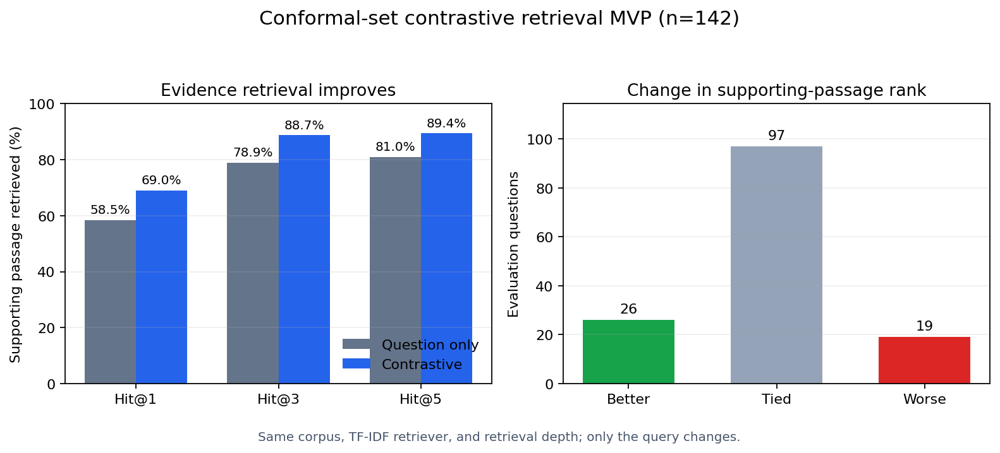

# VLM-LLM-UQ
## Uncertainty Quantification of Vision Language Models and Large Language Models

### Instructions

```
conda env create -f environment.yml
conda activate uq
pip install git+https://github.com/haotian-liu/LLaVA.git 
python app.py
```
Structure your prompt in the following way
```
Question
A. Option A
B. Option B
C. Option C
D. Option D
E. I don’t know
F. None of the above
```

## Contrastive retrieval MVP

The standalone experiment in `experiments/contrastive_retrieval.py` tests one
narrow hypothesis: when the conformal set has multiple answers, does appending
only those surviving answer texts to the retrieval query find the supporting
passage more often than querying with the question alone?

It uses an even-ID calibration / odd-ID evaluation split, treats the 97 unique
MMBench hints as the retrieval corpus, and holds the TF-IDF retriever and depth
fixed so that only the query changes.

```bash
python -m experiments.contrastive_retrieval \
  --data mmbench.pkl \
  --output results/contrastive_retrieval_mvp.json \
  --plot results/contrastive_retrieval_mvp.png
```

On the 142 eligible held-out non-singletons, the contrastive query improved
hit@1 from 58.5% to 69.0%, hit@3 from 78.9% to 88.7%, and MRR from 0.688 to
0.783. It improved the paired supporting-passage rank in 26 cases, tied in 97,
and worsened it in 19. The committed JSON contains the complete run output.



This is intentionally a retrieval-only MVP. It measures the rank of a known
supporting passage; it does not yet generate a new answer, recompute the set
after retrieval, or claim conformal coverage for the RAG pipeline. That next
step requires an evidence-conditioned scorer and separate pipeline calibration.

Run the focused tests with:

```bash
python -m unittest discover -v
```
