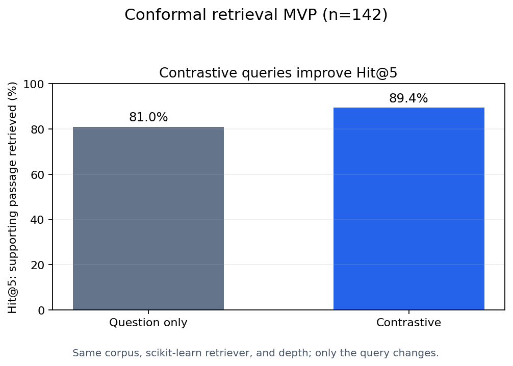

# VLM-LLM-UQ
## Uncertainty Quantification of Vision Language Models and Large Language Models

### Instructions

```
conda env create -f environment.yml
conda activate uq
pip install git+https://github.com/haotian-liu/LLaVA.git 
python app.py
```
Structure your prompt in the following way
```
Question
A. Option A
B. Option B
C. Option C
D. Option D
E. I don’t know
F. None of the above
```

## Contrastive retrieval MVP

The standalone experiment in `experiments/contrastive_retrieval.py` tests one
narrow hypothesis: when the conformal set has multiple answers, does appending
only those surviving answer texts to the retrieval query find the supporting
passage more often than querying with the question alone?

It uses an even-ID calibration / odd-ID evaluation split, treats the 97 unique
MMBench hints as the retrieval corpus, and holds scikit-learn's TF-IDF plus
cosine `NearestNeighbors` retriever and depth fixed so that only the query
changes.

```bash
python -m experiments.contrastive_retrieval \
  --data mmbench.pkl \
  --output results/contrastive_retrieval_mvp.json \
  --plot results/contrastive_retrieval_mvp.png
```

On the 142 eligible held-out non-singletons, the contrastive query improved
Hit@5 from 81.0% to 89.4%. The committed JSON contains the complete run output.



This is intentionally a retrieval-only MVP. It measures whether a known
supporting passage appears in the first five results; it does not yet generate a
new answer, recompute the set after retrieval, or claim conformal coverage for
the RAG pipeline. That next step requires an evidence-conditioned scorer and
separate pipeline calibration.

## Generate-then-retrieve VQA

`rag`: original image + question → visual description and draft option → CLIP retrieval → final LLaVA answer. It uses `openai/clip-vit-base-patch32`, with greedy decoding and no training or hosted
inference. CLIP image and text vectors are normalized separately and fused with equal weight, then normalized again. 

Prepare the images explicitly, then build the reference index:

```bash
python -m rag prepare-images --data mmbench.pkl
python -m rag build-index --data mmbench.pkl
```

Retrieval uses cosine similarity and returns three examples.

The index contains `vectors.npy` and `metadata.json`; descriptions and individual embeddings are checkpointed under `cache/` so interrupted builds can reuse them.
Configuration, model revisions, preprocessing, tokenizer vocabulary, runtime versions, dataset and manifest fingerprints, and vector checksums are checked on reuse.

Answer a new multiple-choice question:

```bash
python -m rag answer \
  --image cat.jpg \
  --question 'What animal is shown?' \
  --choice 'A=cat' --choice 'B=dog' --choice 'C=horse' \
  --output results/cat_rag.json
```

### Results with/without APS candidate-based retrieval

| Metric | Primary: 114 group representatives | Secondary: 460 records including rotations |
| --- | ---: | ---: |
| Draft accuracy before retrieval | 92/114 = 80.70% | 338/460 = 73.48% |
| Final accuracy, draft-based retrieval | 85/114 = 74.56% | 322/460 = 70.00% |
| Final accuracy, APS candidate retrieval | 84/114 = 73.68% | 316/460 = 68.70% |
| APS change versus draft-based retrieval | −0.88 percentage points | −1.30 percentage points |
| Improved / harmed versus draft-based retrieval | 2 / 3 | 2 / 8 |
| Initial APS set coverage | 107/114 = 93.86% | 432/460 = 93.91% |
| Mean initial set size | 2.45 | 2.52 |
| Changed top-three retrieval rankings | 43 | 192 |
| Invalid drafts / final predictions / sets | 0 / 0 / 0 | 0 / 0 / 0 |
| Processing failures / context reductions | 0 / 0 | 0 / 0 |

Candidate-based retrieval did not improve accuracy.